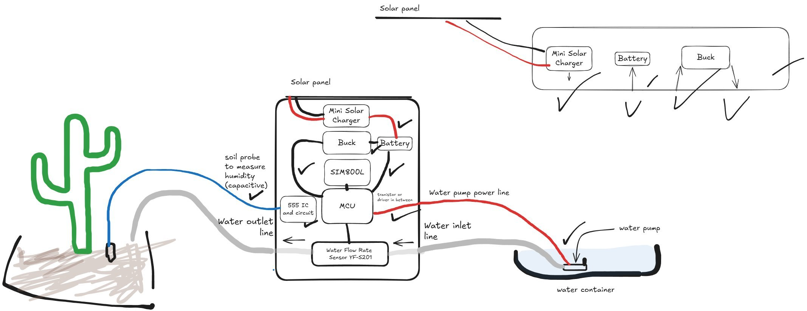
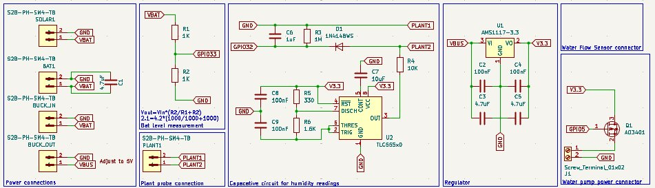
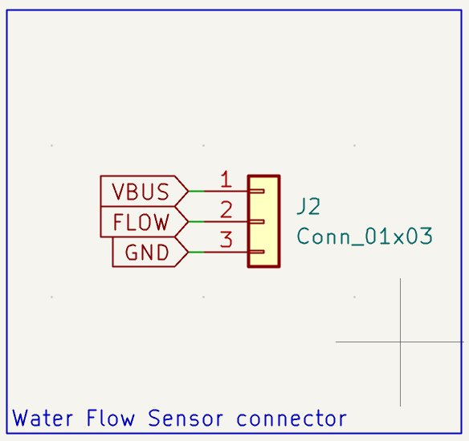

# Plant Buddy — Journal Export

- Exported at: 2026-07-27T00:40:03Z
- Project ID: 4602
- Entries: 12

## Entry 1
- ID: 14694
- Author: Mo
- Created At: 2026-06-17T05:17:53Z

### Content

I first sketched out my thoughts on Excalidraw then start making the schematics off of it:

I finished a part of the schematics but there's a lot left to do.

### Recording Links

- https://lookout.hackclub.com/api/media/44d95b6e-832b-497f-ad53-9a4256ca0aa4/video.mp4

## Entry 2
- ID: 14709
- Author: Mo
- Created At: 2026-06-17T06:57:26Z

### Content

Added a connector the water flow sensor (mind you that it runs on 5 volts so I had to make step up board output 5V instead of 3.3V. I'll be using the LDO's output as the VBUS for the ESP32 and other components running on 3.3V)

### Recording Links

- https://lookout.hackclub.com/api/media/3beeefda-2175-451c-a2ec-e248ded411d0/video.mp4

## Entry 3
- ID: 14888
- Author: Mo
- Created At: 2026-06-18T00:29:38Z

### Content

Made a lot of things in one day.
I finished the schematics, the PCB, and what's left for now is the Case and an adapter for the hose as it's too small for the water flow sensor.
Here's what the PCB and the Schematics look like:

I used the ESP32 devkit as it's more available in my country and cheaper than the wroom module. Plus it helps with reparability. 

### Recording Links

- https://lookout.hackclub.com/api/media/27bd34d5-f5ff-4612-8b61-ed291d3221e3/video.mp4

## Entry 4
- ID: 15409
- Author: Mo
- Created At: 2026-06-20T01:20:02Z

### Content

I have connected a ring line so the esp32 can wake up whenever the sim800l module receives a message. Also I'm routing the tracks to both the front and back sides of copper layers as my manufacturer doesn't have plated through holes.

for now, I'm still figuring out how the codes will work and there's a lot of undecided things.

### Recording Links

- https://lookout.hackclub.com/api/media/fcdc8102-188f-40f8-956a-141435dee443/video.mp4

## Entry 5
- ID: 15506
- Author: Mo
- Created At: 2026-06-20T07:15:06Z

### Content

Extremely exhausted.
I did the code, made it somewhat basic (no replying to user messages, no measuring for the amount of water poured since I need the sensor to be physically available so I can calibrate the firmware to it). But I believe it is sufficient for now.

### Recording Links

- https://lookout.hackclub.com/api/media/376545c8-d42d-4711-8be1-f17a7eec2e2d/video.mp4

## Entry 6
- ID: 15558
- Author: Mo
- Created At: 2026-06-20T11:34:44Z

### Content

I finished the 3D model. what's left for now is the readme, the zine poster, and some 3D renders for the poster.

Here's how the device looks like:

### Recording Links

- https://lookout.hackclub.com/api/media/ab6cfb18-3d7e-450d-b56a-0922fbad71be/video.mp4

## Entry 7
- ID: 15587
- Author: Mo
- Created At: 2026-06-20T13:21:14Z

### Content

Me and blender are going through the same thing rn (both of us are crashing out):

Beside that, I have finished the showcase on fusion360 and I might be using this for the poster instead of blender:

(it's imperfect but I will improve it)

### Recording Links

- https://lookout.hackclub.com/api/media/a747f22e-693e-41f7-b371-261eb6d79cd6/video.mp4

## Entry 8
- ID: 15895
- Author: Mo
- Created At: 2026-06-21T01:42:23Z

### Content

Finished the render!

it was kind of hard as my device is 5 years old with a somewhat dated graphics card, but I managed to work with it!

Here's how the render looks like:

I wanted to add more grass as it would look more realistic but my device can't handle it.

I might modify the texture later and then re-render it. But for now, I'm satisfied with this render.

### Recording Links

- https://lookout.hackclub.com/api/media/40ab7a47-8c26-4372-bd49-37252a3c831d/video.mp4

## Entry 9
- ID: 15911
- Author: Mo
- Created At: 2026-06-21T02:49:51Z

### Content

I modified the texture's a bit so they look better.

I made the water tube transparent, added better color to the wires connected to the probe that's in the soil, and I fixed some things like the cable of the flow sensor being green (made it black), and the screw of the flow sensor were also green (made them black).

Here's what the render looks like:

### Recording Links

- https://lookout.hackclub.com/api/media/63ef874c-4d73-4984-b8f3-b1262206fcad/video.mp4

## Entry 10
- ID: 15968
- Author: Mo
- Created At: 2026-06-21T08:21:33Z

### Content

Added all the required files.

I made sure all the files are available (like the Fusion files, media, etc.)

What's left now is the Zine poster, and the README.

Also made this drawing so reviewers can understand how everything works better:

### Recording Links

- https://lookout.hackclub.com/api/media/1dafa0e2-5839-47d0-afe5-de055ddee4ca/video.mp4

## Entry 11
- ID: 16069
- Author: Mo
- Created At: 2026-06-23T03:46:48Z

### Content

I finished the BOM and changed the 1.6Kohm resistor (that is used with the 555 timer for capacitive soil moisture readings) with a 1.5Kohm resistor. 

The reason I changed it is that I wasn't able to find 1.6Kohm resistors anywhere.

### Recording Links

- https://lookout.hackclub.com/api/media/fbb3ce3d-9b23-4fc6-85db-722628a7d8d8/video.mp4

## Entry 12
- ID: 16192
- Author: Mo
- Created At: 2026-06-25T07:52:30Z

### Content

Finished the zine and the README!

There's nothing much to say for this journal.

Here's the README contents:

Here's the zine poster:

### Recording Links

- https://lookout.hackclub.com/api/media/d3a80291-8f6e-4dda-83fb-e65016a85ed3/video.mp4
