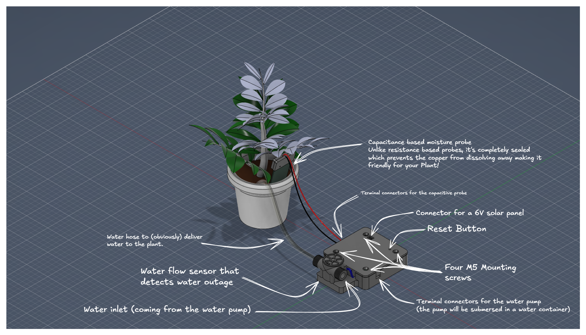
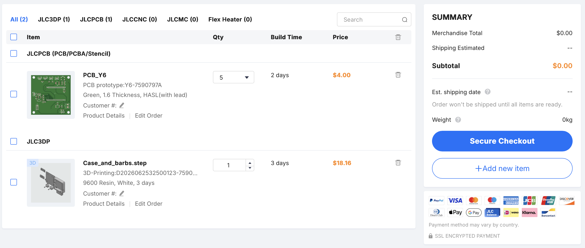

# Plant Buddy


## The reason I made it
I have a plant at a remote location and I only go there once in a while, I was afraid that that plant might die because of the lack of water so I decided to make this device. It work by connecting a water pump to it, then it drives this pump every 20 days by default (configurable in the code). It measures the soil humidity for feedback to the user (which is delivered through SMS).

## The poster


## Photos

|Schematic                                            |PCB                                    |3D View                                  |Showcase                                            |
|-----------------------------------------------------|---------------------------------------|-----------------------------------------|----------------------------------------------------|
|||||

## Step files
All of the step files can be found [here](./Step_Files/).
<br>

## Firmware
### Compile and flash using the Arduino IDE
If you want to edit the code, compile it yourself, then flash it; you can download the arduino sketch [here](./Source/Firmware/Arduino/plant_buddy).

### Flash the firmware as is
If you want to flash the firmware as is, you can download it [here](./source/Firmware/Firmware). <br>
You can use [ESPWebTool](https://esptool.spacehuhn.com) to flash the firmware directly to the ESP32 using your browser.<br>
Note that there might be some changes between the Arduino code and the firmware as some changes were made.

## Device Operation
### Power supply
The device is powered a 3.7V recharge Li-Po battery.<br>
The battery is recharged daily using a 3W 6V mini solar panel connected to a mini solar charger which is connected to a buck converter to operate the ESP32.<br>
The ESP32 goes into Deep Sleep mode in between watering sessions to help decrease energy consumption.<br>

### Startup Notification

Whenever the ESP32 wakes up, it sends a status report to the user containing:

* Current battery level
* Current soil moisture level
* Watering interval
* Reason for waking up

Example:

```
The device just booted up!
Battery level: 87%
Soil humidity: 42%
Watering interval: 3 days

Boot reason: Watering cycle completed successfully.
Watering again in 3 days.
```

Possible boot reasons:

| Boot Reason              | Description                                                                       |
| ------------------------ | --------------------------------------------------------------------------------- |
| Unknown Fault            | The device restarted unexpectedly due to an unknown error.                        |
| Watering Cycle Completed | A watering cycle has just finished successfully, and a new countdown has started. |
| First Boot               | The device has been powered on for the first time.                                |

## BOM
### BOM Table (components only)
|Name                                                 |Link                                   |Cost per one (EGP)                       |Cost per one (USD)                                  |Amount     |Total cost|
|-----------------------------------------------------|---------------------------------------|-----------------------------------------|----------------------------------------------------|-----------|----------|
|JST Connectors                                       |https://www.ram-e-shop.com/shop/pw-m-pcb-2pin-pw-m-2-pin-polarized-male-jst-xh2-54-connector-for-pcb-6463| EGP 0.60                                | $0.012                                             |5          | $0.060   |
|4.7uF Caps (1206)                                    |https://lampatronics.com/product/smd-multilayer-ceramic-capacitor-1206-4-7uf-16v-1pcs| EGP 1.50                                | $0.030                                             |4          | $0.120   |
|100nF Caps (0805)                                    |https://lampatronics.com/product/smd-multilayer-ceramic-capacitor-0805-2012-104-100nf-50v-1pcs-2| EGP 1.00                                | $0.020                                             |6          | $0.120   |
|1uF Caps (0805)                                      |https://lampatronics.com/product/smd-ceramic-capacitor-0805-1051uf-50v-1pcs| EGP 1.50                                | $0.030                                             |1          | $0.030   |
|10uF Caps (0805)                                     |https://lampatronics.com/product/smd-multilayer-ceramic-capacitor-0805-10610uf-16v-1pcs| EGP 1.50                                | $0.030                                             |1          | $0.030   |
|1N4148WS Diode                                       |https://lampatronics.com/product/smd-diode-1n4148ws-10pcs| EGP 7.50                                | $0.150                                             |1          | $0.150   |
|Screw terminal                                       |https://www.ram-e-shop.com/shop/r-3-roseta-2pin-2-pin-pcb-screw-terminal-block-pitch-5mm-r-3-5854| EGP 3.00                                | $0.060                                             |1          | $0.060   |
|Male headers                                         |https://store.fut-electronics.com/products/male-pin-headers-standard-2-54-mm-40-pin?_pos=1&_sid=73894fcce&_ss=r| EGP 10.00                               | $0.200                                             |1          | $0.200   |
|Female headers                                       |https://www.ram-e-shop.com/shop/ph35-1x4-female-ph35-pin-header-female-1x4-straight-2-54mm-6976| EGP 1.50                                | $0.030                                             |2          | $0.060   |
|AO3401 (transistor for pump)                         |https://uge-one.com/product/ao3401-sot23-general-purpose-p-channel-mosfet-smd-transistor-sot-23/| EGP 3.00                                | $0.060                                             |1          | $0.060   |
|1K ohm Resistors                                     |https://lampatronics.com/product/smd-resistor-1kohm-102-0805-10pcs| EGP 2.00                                | $0.040                                             |1          | $0.040   |
|1M ohm Resistors                                     |https://lampatronics.com/product/smd-resistor-1mohm-105-0805-10pcs| EGP 2.00                                | $0.040                                             |1          | $0.040   |
|10K ohm Resistors                                    |https://lampatronics.com/product/smd-resistor-10kohm-103-0805-10pcs| EGP 2.00                                | $0.040                                             |1          | $0.040   |
|330 ohm Resistors                                    |https://lampatronics.com/product/smd-resistor-330ohm-331-0805-10pcs| EGP 2.00                                | $0.040                                             |1          | $0.040   |
|1.5Kohm Resistors                                    |https://lampatronics.com/product/resistor-1-5k-ohm-1-4w-4pcs-2| EGP 0.30                                | $0.006                                             |1          | $0.006   |
|2K ohm Resistors                                     |https://lampatronics.com/product/smd-resistor-2kohm-202-0805-10pcs| EGP 2.00                                | $0.040                                             |1          | $0.040   |
|3K ohm Resistors                                     |https://lampatronics.com/product/smd-resistor-3kohm-302-0805-10pcs| EGP 2.00                                | $0.040                                             |1          | $0.040   |
|220 ohm Resistors                                    |https://lampatronics.com/product/smd-resistor-220ohm-221-0805-10pcs| EGP 2.00                                | $0.040                                             |1          | $0.040   |
|Reset Push Button                                    |https://lampatronics.com/product/push-button-4pin-long-6x6x13mm| EGP 1.50                                | $0.030                                             |1          | $0.030   |
|Voltage Regulator                                    |https://lampatronics.com/product/ams1117-33v-sot-223-33v-linear-voltage-regulator| EGP 2.00                                | $0.040                                             |1          | $0.040   |
|TLC555xD (Capacitive soil readings)                  |https://uge-one.com/product/tlc555cdr-low-power-cmos-timer-ic-smd-sop8/| EGP 35.00                               | $0.700                                             |1          | $0.700   |
|PC817 optocoupler                                    |https://lampatronics.com/product/pc817-optocoupler-dip-4| EGP 1.25                                | $0.025                                             |1          | $0.025   |
|ESP32 DevKit                                         |https://lampatronics.com/product/esp32-30pin-development-board-wifi-and-bluetooth| EGP 325.00                              | $6.500                                             |1          | $6.500   |
|Water Pump                                           |https://www.ram-e-shop.com/shop/dc-pump-6vdc-water-pump-3-6vdc-mini-120l-h-7422| EGP 45.00                               | $0.900                                             |1          | $0.900   |
|Hose (inner d: 6mm , outer d: 8mm) 1 Meter           |https://lampatronics.com/product/flexible-clear-hose-tube-pipe-6mm-airwater-pump-pvc| EGP 15.00                               | $0.300                                             |2          | $0.600   |
|Water Flow sensor                                    |https://store.fut-electronics.com/products/water-flow-rate-sensor?_pos=8&_sid=5e9c09df8&_ss=r| EGP 260.00                              | $5.200                                             |1          | $5.200   |
|SIM800L GSM Module                                   |https://store.fut-electronics.com/collections/gsm-gprs/products/sim800l-gprs-gsm-module-esp-core-board-with-built-in-antenna| EGP 280.00                              | $5.600                                             |1          | $5.600   |
|3W 6V Mini Solar Panel                               |https://store.fut-electronics.com/products/solar-cell-129-x-129-mm-3w?_pos=3&_sid=fdb2b11fe&_ss=r| EGP 155.00                              | $3.100                                             |1          | $3.100   |
|Mini solar charger                                   |https://store.fut-electronics.com/products/solar-usb-charger-for-lithium-batteries-lipo-rider?_pos=5&_sid=fdb2b11fe&_ss=r| EGP 160.00                              | $3.200                                             |1          | $3.200   |
|Battery                                              |https://store.fut-electronics.com/products/3-7v-rechargeable-polymer-lithium-ion-battery-ecocell?_pos=3&_sid=4fcef8d7d&_ss=r| EGP 125.00                              | $2.500                                             |1          | $2.500   |
|M5 Screws                                            |https://store.fut-electronics.com/products/screw-m5x25mm-hexagonal-head?_pos=5&_sid=c4191184f&_ss=r| EGP 2.00                                | $0.040                                             |4          | $0.160   |
|                                                     |                                       |                                         |                                                    |           |          |
|                                                     |                                       |                                         |                                                    |Whole Total| $29.731  |

### Quotes
[JLCPCB](https://jlcpcb.com) : $57.12

<br>
Note that local manufacturers might have different prices.

## Notes
A future V2 is planned with support for multiple probes, improved power efficiency, and user-requested status updates.

> Made and designed by [@mkhairyx](https://github.com/mkhairyx).<br>
Supported by [Fallout](https://fallout.hackclub.com/) and [Hack Club](https://hackclub.com).<br>
